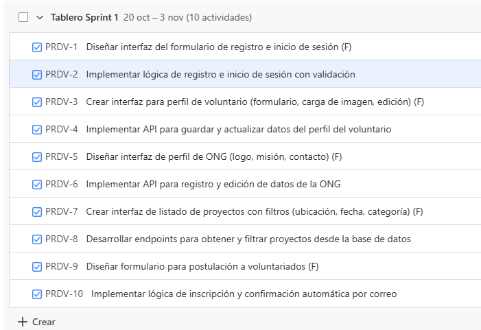
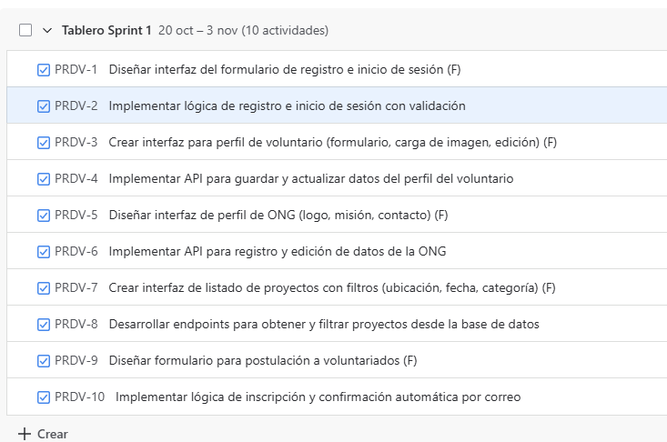

"Año de la recuperación y consolidación de la economía peruana"

 

AVANCE PROYECTO FINAL 2

RED DE VOLUNTARIADO AMBIENTAL

CURSO: DISEÑO DE PRODUCTOS Y SERVICIOS
DOCENTE: GUEVARA JIMENEZ, JORGE ALFREDO
SECCIÓN: 19493

INTEGRANTES:

•	Gonzales Ochoa, Naomi Nicolle			U22240683
•	Lima Ramos, Angello Mathias			U23323686
•	Magallanes Saldaña, Alexandra			U24259381
•	Mendoza Asencios, Gustavo Enrique		 U24258871
•	Ramirez Mendez, Juan Aldair			U20201597
•	Lumini (Asistente Virtual)	

Lima – Perú
2025
 
Índice
1.	Capítulo 1: Introducción	7
1.1.	Describir ODS	7
1.2.	Problema	7
1.3.	Solución	8
1.4.	Objetivo	8
1.5.	Antecedentes	9
1.5.1.	Nacionales	9
1.5.2.	Internacionales	10
1.6.	Marco teórico:	11
1.6.1.	Fundamentos del diseño de productos y servicios	11
1.6.2.	Etapas del Design Thinking	11
1.6.3.	Investigación de usuarios y técnicas de entrevistas	12
1.6.4.	Perfiles de usuario: perfiles extremos y protopersonas	12
1.6.5.	Job to be Done	12
1.6.6.	BrenchMarking	13
1.6.7.	Propuesta de Valor	13
1.6.8.	Brainstorming	13
1.6.9.	Storyboards y MVP	13
2.	Capítulo 2: Desarrollo	14
2.1.	Unidad I: Fundamentos del diseño de productos y servicios y Empatía	14
2.1.1.	Etapas del Design Thinking	14
2.1.1.1.	Empatizar	14
2.1.1.2.	Definir	14
2.1.1.3.	Idear	15
2.1.1.4.	Prototipar	15
2.1.1.5.	Evaluar	22
2.1.2.	Investigación de usuarios y técnicas de entrevistas	22
2.1.2.1.	Selección de usuarios	23
2.1.2.2.	Objetivo de la investigación	23
2.1.2.3.	Preguntas de la entrevista	23
2.1.2.4.	Análisis de resultados	24
2.1.2.5.	Ejemplos de resultados	25
2.1.3.	Perfiles de usuarios y Perfiles Extremos	31
2.1.3.1.	Perfil de usuario promedio	31
2.1.3.2.	Perfil extremo izquierdo	31
2.1.3.3.	Perfil extremo derecho	31
2.1.4.	Protopersonas	32
2.1.5.	Segmentación del Mercado:	33
2.2.	Unidad II: Generación de ideas y conceptos	34
2.2.1.	Job to be Done	34
2.2.2.	Ideación de Conceptos	35
2.2.2.1.	Método de Factores Ponderados	35
2.2.3.	Brenchmarking	36
2.2.3.1.	Objetivo del brenchmarking	36
2.2.3.2.	Recopilación de datos y análisis comparativo	37
2.2.3.3.	Implementación de mejoras	38
2.2.4.	Propuesta de valor	39
2.2.4.1.	Elementos de la Propuesta de Valor	39
2.2.4.2.	Beneficios para el usuario	39
2.2.5.	Lluvia de ideas y Brainstorming	40
2.2.5.1.	Enfoque adoptado: Estructurado	40
2.2.5.2.	Fase 1: Preparación	40
2.2.5.3.	Fase 2: Generación de Ideas	40
2.2.5.4.	Fase 3: Organización y Evaluación	42
2.2.5.5.	Fase 4: Evaluación y Selección de Ideas	42
2.2.6.	Propuesta de valor clara	44
2.2.7.	Elevator pitch	45
2.2.8.	Hipótesis, Prototipos y Conceptos de Solución (Storyboards y MVP)	45
2.2.8.1.	Hipótesis	45
2.2.8.2.	MVP	46
2.2.8.3.	Storyboards	47
3.	Capítulo 3: Conclusiones	70
3.1.	Lecciones aprendidas de cada tema de la unidad	70
3.2.	Lecciones aprendidas del equipo de trabajo por estudiante	70
4.	Referencias bibliográficas	73
5.	Anexos	75

Índice de tablas
Tabla 1 Frecuencia de las dificultades al buscar proyectos de voluntariado	25
Tabla 2 Escala de compatibilidad de horarios	25
Tabla 3 Nivel de dificultad del proceso de inscripción	26
Tabla 4 Nivel de confianza en ONGs	27
Tabla 5 Frecuencia de la información más valorada para decidir participar	28
Tabla 6 Frencuencia de las funcionalidades motivadoras	28
Tabla 7 Nivel de importancia del reconocimiento digital	29
Tabla 8 Nivel de preferencia por plataforma con comunidad	30
Tabla 9 Job-to-be-Done del Voluntario Ambiental	34
Tabla 10 Análisis de Motivaciones y Frustraciones del Voluntario Ambiental	34
Tabla 11 Matriz de Ponderación y Evaluación de Alternativas de Solución	36
Tabla 12 Benchmarking de Plataformas de Voluntariado Ambiental y Social	37
Tabla 13 Propuestas de Innovación Basadas en la Metodología SCAMPER	41
Tabla 14 Análisis de Criterios para la Evaluación de Viabilidad de la Solución	42
Tabla 15 Matriz de Ponderación para Funcionalidades Clave de la Plataforma	43
Tabla 16 Plan de Desarrollo del Producto Mínimo Viable (MVP)	46

Índice de figuras
Figura 1 Modelo de componentes	17
Figura 2 Prototipo 1 - Página web interactiva (versión escritorio)	17
Figura 3 Prototipo 2 – Página web interactiva (calendario)	18
Figura 4 Prototipo 3 – Página web interactiva (historias de impacto)	18
Figura 5 Prototipo 4 - Aplicación móvil (vista de proyectos cercanos)	19
Figura 6 Prototipo 5 – Aplicación móvil (gamificación)	20
Figura 7 Prototipo 6 - Aplicación móvil (registro y validación).	20
Figura 8 Prototipo 7 – Plataforma híbrida (comunidad digital)	21
Figura 9 Prototipo 8 - Plataforma híbrida (foros y reputación)	22
Figura 10 Prototipo 9 - Plataforma híbrida (certificados digitales y reuniones)	22
Figura 11 Histograma de las dificultades al buscar proyectos de voluntariado	26
Figura 12 Histograma de la compatibilidad de horarios	27
Figura 13 Nivel de dificultad del proceso de inscripción según porcentaje	28
Figura 14 Grado de confianza de los usuarios en ONGs	28
Figura 15 Información más valorada al decidir participar en un proyecto	29
Figura 16 Funcionalidades que más motivan la participación según porcentaje	30
Figura 17 Importancia del reconocimiento digital	31
Figura 18 Preferencia por plataforma con comunidad según porcentaje	31
Figura 19  Interfaz de Usuario: Registro de usuario voluntario.	49
Figura 20 Interfaz de Usuario: Formulario de registro de voluntario	49
Figura 21 Interfaz de Usuario: Vista para completar el perfil	50
Figura 22 Interfaz de ONG: Registro de usuario ONG	51
Figura 23 Interfaz de ONG: Registro de ONG (Paso 1 de 3)	51
Figura 24 Interfaz de ONG: Prototipo de Registro de ONG (Paso 2 de 3)	52
Figura 25 Interfaz de ONG: Solicitud de Registro de ONG Enviada (Paso 3 de 3)	52
Figura 26 Interfaz de Usuario: Configuración de Perfil – Información Básica	53
Figura 27 Interfaz de Usuario: Configuración de Perfil – Intereses y Habilidades	54
Figura 28 Interfaz de Usuario: Configuración de Perfil – Disponibilidad de Tiempo	54
Figura 29 Interfaz de ONG: Perfil de la Organización	55
Figura 30 Interfaz de ONG: Edición del Perfil de la ONG - Información General	55
Figura 31 Interfaz de ONG: Vista de perfil público de la ONG	56
Figura 32 Interfaz de Usuario: Vista General de Explorar Eventos	57
Figura 33 Interfaz de Usuario: Explorar Eventos con Filtro Aplicado	57
Figura 34 Interfaz de Usuario: Pantalla de Eventos con Filtros Avanzados	58
Figura 35 Interfaz de ONG: Panel de Gestión de Eventos - Vista Listado	59
Figura 36 Interfaz de ONG: Creación de Evento (Información, Fecha y Ubicación)	59
Figura 37 Interfaz de ONG: Creación de Evento (Requisitos de Participación)	60
Figura 38 Interfaz de ONG: Publicar Evento	60
Figura 39 Interfaz de Usuario: Panel de Logros y Progresos del Voluntario	61
Figura 40 Interfaz de Usuario: Panel de Logros del Voluntario - Vista Certificados	61
Figura 41 Interfaz de ONG: Panel de Configuración de Certificados de la ONG	62
Figura 42 Interfaz de ONG: Creación de Plantilla de Certificado	63
Figura 43 Interfaz de ONG: Vista Previa de Diseño de Certificado	63
Figura 44 Interfaz de Usuario: Panel Logros del Voluntario - Insignias Ganadas	64
Figura 45 Interfaz de Usuario: Panel Logros del Voluntario - Progreso de Insignias	64
Figura 46 Interfaz de Usuario: Panel de Logros del Voluntario - Vista Ranking	65
Figura 47 Interfaz de Usuario: Perfil del Voluntario - Vista Reseñas	65
Figura 48 Interfaz de Usuario: Formulario para Publicar Reseña	66
Figura 49 Interfaz de ONG: Panel de Gestión - Vista Resumen y Métricas	67
Figura 50 Interfaz de ONG: Panel de Gestión - Vista Reseñas y Evaluaciones	67
Figura 51 Interfaz de Usuario: Foro Comunitario - Vista Principal y Temas	68
Figura 52 Interfaz de Usuario: Foro Comunitario - Formulario Nueva Publicación	68
Figura 53 Interfaz de ONG: Perfil de ONG - Vista Logros y Reconocimientos	69
Figura 54 Interfaz de ONG: Formulario para Publicar Nuevo Logro de la ONG	70

 
1.	Capítulo 1: Introducción
1.1.	Describir ODS
En el contexto peruano, uno de los desafíos ambientales es la limitada articulación entre ciudadanos y organizaciones para impulsar acciones sostenibles. La Red de Voluntariado Ambiental busca responder a esta necesidad mediante una plataforma digital que conecta de manera eficiente a voluntarios con ONGs, promoviendo la participación activa en iniciativas que favorezcan la conservación y el cuidado del entorno natural (Naciones Unidas, 2015).
El proyecto se alinea principalmente con los ODS 13 (Acción por el clima) y ODS 15 (Vida de ecosistemas terrestres), al fomentar la participación ciudadana en proyectos orientados a la adaptación al cambio climático, la protección de ecosistemas y la promoción de prácticas sostenibles. De esta manera, la plataforma contribuye a generar un impacto ambiental positivo a través del voluntariado organizado y accesible (CEPAL, 2022).
Asimismo, la iniciativa se articula con el ODS 17 (Alianzas para lograr los objetivos), al fortalecer la cooperación entre ONGs, ciudadanos y comunidades. Tal como señalan Naciones Unidas (2015), la creación de redes colaborativas es esencial para alcanzar las metas de la Agenda 2030. En este sentido, la Red de Voluntariado Ambiental constituye no solo una herramienta tecnológica, sino también un espacio de empoderamiento social que transforma el interés ciudadano en acciones sostenibles de impacto real.
1.2.	Problema
En el Perú, uno de los principales retos para las organizaciones ambientales y los ciudadanos interesados en el voluntariado es la dificultad de acceso a información clara, centralizada y confiable sobre proyectos disponibles. 
Esta situación se refleja en la baja tasa de participación ciudadana en programas de voluntariado ambiental, muchas veces vinculada a la falta de confianza en las ONGs y a la dificultad para encontrar proyectos que se ajusten a intereses, capacidades y horarios específicos. Como señalan Naciones Unidas (2015), la ausencia de canales efectivos de articulación limita el impacto colectivo de la ciudadanía en el cumplimiento de los Objetivos de Desarrollo Sostenible.
En consecuencia, surge la necesidad de una herramienta digital que actúe como puente entre ONGs y voluntarios, facilitando la inscripción en proyectos, la transparencia de la información y el reconocimiento del aporte ciudadano. Una plataforma de este tipo no solo incrementaría la participación activa, sino que también fortalecería la confianza y la sostenibilidad de las iniciativas ambientales en el país (García & Raufflet, 2019).
1.3.	Solución
La propuesta de la Red de Voluntariado Ambiental consiste en el desarrollo de una plataforma digital interactiva que centralice la información sobre proyectos ambientales y facilite la conexión entre ONGs y ciudadanos. Esta herramienta permitirá a los voluntarios acceder a oportunidades de acuerdo con su disponibilidad de tiempo, intereses y ubicación, al mismo tiempo que garantizará mayor transparencia y confianza mediante la validación de las organizaciones y la claridad en los detalles de cada proyecto. 
Asimismo, la plataforma incorporará funcionalidades que incrementen la motivación y la permanencia de los voluntarios, como notificaciones de proyectos cercanos, calendarios integrados y certificados digitales de reconocimiento. Estas estrategias de diseño, orientadas a la usabilidad y la experiencia del usuario, permiten convertir el interés ciudadano en acciones sostenibles de impacto real (Naciones Unidas, 2015). 
1.4.	Objetivo
El objetivo de la Red de Voluntariado Ambiental es crear una plataforma digital que conecte de manera eficiente a voluntarios con ONGs ambientales, facilitando el acceso a información clara, la inscripción en proyectos y el reconocimiento del aporte ciudadano. Con ello, se busca incrementar la participación en iniciativas sostenibles y fortalecer el impacto colectivo de las acciones ambientales. Tal como destacan García y Raufflet (2019), las herramientas digitales que promueven la colaboración entre actores sociales resultan clave para impulsar la sostenibilidad y el compromiso comunitario.
1.5.	Antecedentes
1.5.1.	Nacionales
Programa de Voluntario: “Yo Promotor Ambiental” (MINAM)
Este programa es una iniciativa oficial del Estado peruano, gestionada por el Ministerio del Ambiente (MINAM), que convoca anualmente a jóvenes para que participen activamente en la gestión ambiental del país. Su objetivo es la formación de ciudadanos como agentes de cambio que contribuyan a la conservación y a la sensibilización social sobre la protección del entorno (Ministerio del Ambiente, 2024). La importancia de este antecedente radica en que demuestra un modelo centralizado de voluntariado a nivel nacional, respaldado por una entidad gubernamental.
Programa de Voluntariado de la Municipalidad de Lima Ciudades Verdes 2025-1
El Programa de Voluntariado de la Municipalidad de Lima colabora activamente en iniciativas ambientales recientes, como el Voluntariado Ciudades Verdes 2025-1 y jornadas de limpieza de playas (Universidad de Lima, 2025). Su fortaleza es el fuerte impacto local y comunitario, pero al operar principalmente a través de coordinaciones institucionales (a menudo con universidades), se confirma la ausencia de una aplicación móvil propia y una comunicación digital unificada que permita una gestión de voluntarios más ágil y directa.
Red de Voluntariado PUCP
La Red de Voluntariado PUCP ha continuado el desarrollo de programas de Responsabilidad Social Universitaria (RSU), alineando sus proyectos a la Agenda 2030 y los Objetivos de Desarrollo Sostenible (ODS), con convocatorias abiertas en 2025 que requieren la condición de ser estudiante de la universidad (PUCP, 2025). Esto ratifica su fortaleza en el soporte académico y la alta motivación juvenil, pero también subraya su exclusividad institucional, limitando su potencial de movilización a la comunidad interna.
1.5.2.	Internacionales
Organización Idealist
Idealist.org (Action Without Borders) experimentó un cambio clave en 2025 al fusionarse con VolunteerMatch, la mayor red de participación voluntaria en línea. Esta fusión busca crear la plataforma más poderosa del mundo para conectar individuos y organizaciones (Idealist, 2025). Si bien esto potencia su alcance internacional, también confirma su tendencia a ser una plataforma generalista y de alta visibilidad (con una vasta oferta de empleos y networking), lo que podría incrementar la sobrecarga de información y dificultar la búsqueda especializada en el voluntariado ambiental.
Iniciativa Online Volunteering de la ONU
La iniciativa Online Volunteering de la ONU (UNV) ha mostrado una evolución positiva dentro de su Marco Estratégico 2022-2025, reportando una movilización récord de voluntarios en 2024 y un crecimiento significativo en el número de voluntarios en línea solicitados (UNV, 2025). Esto confirma su alta confiabilidad y la madurez del voluntariado digital. Sin embargo, sus procesos, diseñados para un impacto global y con alta fiscalización, mantienen una naturaleza formal que resulta en procesos de selección largos, siendo menos aptos para oportunidades de respuesta local o rápida.
Voluntariado en Australia: GoVolunteer
GoVolunteer (Volunteering Australia) sigue siendo la plataforma de referencia en Australia, manteniendo una buena usabilidad web y ofreciendo modelos claros para la búsqueda de roles de voluntariado (Volunteering Australia, 2025). Su análisis es valioso como modelo nacional bien organizado con un enfoque en la inclusión y el ambiente, pero su restricción geográfica invalida su uso directo en el contexto peruano.
Plataforma en línea Meetup
Meetup ha pasado por cambios corporativos recientes, siendo adquirida por AlleyCorp en 2020 y luego por Bending Spoons en 2024 (Tracxn, 2024). A pesar de estos cambios, su propuesta de valor se mantiene como una herramienta efectiva para la organización ágil de comunidades y eventos locales. Su principal fortaleza es la capacidad de conexión instantánea, pero su debilidad persiste en su naturaleza no especializada. No está diseñada para el voluntariado formal, lo que puede resultar en una dispersión del foco ambiental y la necesidad de una membresía paga para organizadores que deseen crear grupos (Meetup Inc.).
1.6.	Marco teórico:
1.6.1.	Fundamentos del diseño de productos y servicios
El diseño de productos y servicios es un proceso estratégico que busca transformar necesidades de los usuarios en soluciones viables, útiles y sostenibles. Ulrich y Eppinger (2012) señalan que este proceso no se limita al aspecto técnico del producto, sino que involucra factores como la experiencia del usuario, el costo, la viabilidad de producción y el impacto social. En el caso de la Red de Voluntariado Ambiental, comprender estos fundamentos permite estructurar una plataforma digital que no solo funcione como un medio de inscripción, sino que también aporte valor agregado al usuario a través de funcionalidades claras, confiables y adaptadas a sus necesidades.
1.6.2.	Etapas del Design Thinking
El Design Thinking se ha consolidado como una metodología de innovación centrada en las personas, que permite enfrentar problemas complejos mediante cinco fases: empatizar, definir, idear, prototipar y evaluar. Brown (2009) destaca que estas etapas no deben entenderse como lineales, sino como un proceso iterativo que permite ir ajustando las soluciones a medida que se recibe retroalimentación de los usuarios. Para el presente proyecto, las etapas de empatizar y definir fueron claves, pues permitieron identificar las principales frustraciones de voluntarios y ONGs, mientras que las fases de ideación y prototipado ayudaron a visualizar alternativas concretas de solución, como una aplicación móvil o una plataforma híbrida.
1.6.3.	Investigación de usuarios y técnicas de entrevistas
La investigación de usuarios es esencial para asegurar que un producto o servicio se alinee con las verdaderas necesidades de su público objetivo. Goodman, Kuniavsky y Moed (2012) señalan que las entrevistas semiestructuradas, junto con la observación, constituyen técnicas efectivas para obtener información directa sobre motivaciones, frustraciones y expectativas de los usuarios. 
1.6.4.	Perfiles de usuario: perfiles extremos y protopersonas
Los perfiles de usuario permiten crear representaciones arquetípicas de los diferentes segmentos que interactúan con un producto o servicio. Pruitt y Adlin (2006) introducen el concepto de “personas” como una herramienta de diseño centrado en el usuario, y explican que las protopersonas sirven para definir hipótesis iniciales, mientras que los perfiles extremos ayudan a considerar usuarios con necesidades muy diferentes, garantizando soluciones inclusivas. En la Red de Voluntariado Ambiental, estos enfoques permitieron identificar a perfiles con bajo compromiso (ejemplo: estudiantes que buscan horas de voluntariado rápido) y a perfiles altamente comprometidos (profesionales y activistas ambientales), lo que llevó a segmentar la propuesta de valor y diseñar funcionalidades diferenciadas.
1.6.5.	Job to be Done
El enfoque del Job to be Done (JTBD), fundamentalmente asociado al trabajo de Clayton Christensen, establece que los clientes no adquieren productos o servicios por sus atributos inherentes, sino que los "contratan" para realizar un "trabajo" específico o resolver un problema en una circunstancia particular de sus vidas (Christensen et al., 2007). Este trabajo es la unidad de análisis esencial, que se formula como el progreso deseado por el cliente, sirviendo de base para la Ideación de Conceptos.
1.6.6.	BrenchMarking
El Benchmarking constituye una herramienta analítica crítica que permite a las organizaciones comparar sus productos, servicios y procesos con aquellos considerados como "mejores en su clase", ya sean competidores directos o líderes en otras industrias funcionales (Camp, 1989). Su objetivo dentro del marco de la innovación es doble: establecer el estándar actual del mercado e identificar las brechas de valor o áreas de insatisfacción de la competencia. La información obtenida del benchmarking informa directamente la creación de una Propuesta de Valor sólida y diferenciadora.
1.6.7.	Propuesta de Valor
La Propuesta de Valor es la promesa explícita de valor que la empresa entregará al cliente, articulando cómo el producto o servicio resuelve su problema o logra su progreso deseado de una manera superior, única o más eficiente que las alternativas identificadas en el análisis competitivo (Osterwalder & Pigneur, 2013). Así, la Propuesta de Valor se convierte en el argumento central de la ventaja competitiva.
1.6.8.	Brainstorming
Brainstorming es la técnica central de la fase de Ideación, concebida por Alex Osborn para fomentar la creatividad grupal y la generación de un gran volumen de ideas en un entorno no crítico (Osborn, 1953). Este método se basa en el principio de que la cantidad conduce a la calidad y que las ideas de un participante sirven de catalizador para las asociaciones creativas de otros, logrando una sinergia que va más allá de la suma de las contribuciones individuales.
1.6.9.	Storyboards y MVP
El Storyboard, como prototipo de baja fidelidad, es fundamental para visualizar y comunicar la experiencia del usuario en el contexto del JTBD, mostrando la secuencia narrativa de la interacción (desde la necesidad hasta el progreso logrado) (Snyder, 2203). Finalmente, el concepto validado evoluciona hacia un Mínimo Producto Viable (MVP). Según la metodología Lean Startup de Eric Ries (2011), el MVP no es un producto incompleto, sino la versión mínima del nuevo producto que permite al equipo recopilar la máxima cantidad de aprendizaje validado sobre la Propuesta de Valor con el menor esfuerzo. El MVP es la herramienta de experimentación en el mundo real que cierra el ciclo de innovación, validando si los clientes están dispuestos a adoptar la solución que resuelve su JTBD de forma efectiva.
2.	Capítulo 2: Desarrollo
2.1.	Unidad I: Fundamentos del diseño de productos y servicios y Empatía
2.1.1.	Etapas del Design Thinking
2.1.1.1.	Empatizar
En esta fase se busca comprender en profundidad a los usuarios principales de la plataforma: voluntarios y ONGs ambientales. Para ello se realizaron entrevistas semiestructuradas con el fin de detectar frustraciones actuales y reconocer lo que más valoran o desearían encontrar en una herramienta digital que conecte proyectos medioambientales con ciudadanos interesados en participar. A continuación, se brinda un resumen de las necesidades detectadas: 
•	Contar con información clara sobre los proyectos disponibles.
•	Tener una plataforma sencilla para inscribirse y participar. 
•	Encontrar oportunidades que se adapten a la disponibilidad de tiempo. 
•	Poder filtrar y elegir proyectos de voluntariado según intereses específicos.
•	Recibir reconocimiento por la participación y el esfuerzo. 
•	Sentir que el aporte genera un impacto real y formar parte de una comunidad.
2.1.1.2.	Definir
Dificultad de los ciudadanos y las ONGs para encontrar y conectar fácilmente con oportunidades de voluntariado ambiental que se adapten a sus intereses, horarios y capacidades, lo que limita la participación y el impacto de las acciones sostenibles.
2.1.1.3.	Idear
Alternativa 1: Página Web Interactiva
a.	Plataforma accesible desde cualquier dispositivo.
b.	Funciones: filtros avanzados de proyectos, calendario integrado, validación de ONGs, sección de historias de impacto.
c.	Ideal para ONGs que gestionan varios proyectos y para voluntarios que prefieren una herramienta formal y accesible desde computadoras.
Alternativa 2: Aplicación Móvil “Voluntariado Verde” con funciones de gamificación
a.	Notificaciones en tiempo real de proyectos cercanos.
b.	Gamificación: logros, insignias y ranking de voluntarios más activos.
c.	Registro rápido con validación automática de ONGs.
d.	Orientada a voluntarios jóvenes que usan más el celular que la PC.
Alternativa 3: Plataforma Híbrida con Comunidad Digital
d.	Un espacio tipo red social ambiental donde voluntarios y ONGs interactúen.
e.	Se podrían compartir experiencias, fotos y resultados de proyectos.
f.	Funcionalidades: foros, sistema de reputación de ONGs, certificados digitales.
g.	Motiva a la participación constante y genera comunidad.
2.1.1.4.	Prototipar
Modelo de componentes
Figura 1 Modelo de componentes
 
Fuente: Elaboración propia
Alternativa 1: Interfaz de la Página Web Interactiva
Figura 2 Prototipo 1 - Página web interactiva (versión escritorio)
 
OpenAI. (2025). Wireframe mockup of interactive environmental volunteer web
platform with filters and search. DALL·E.
Figura 3 Prototipo 2 – Página web interactiva (calendario)
 
OpenAI. (2025). Wireframe mockup of environmental volunteer website with integrated calendar. DALL·E.
Figura 4 Prototipo 3 – Página web interactiva (historias de impacto)
 
OpenAI. (2025). Wireframe mockup of environmental volunteer website impact stories section. DALL·E.
La imagen presenta una interfaz web responsiva diseñada para organizaciones y usuarios vinculados al voluntariado ambiental. Incluye filtros avanzados para búsqueda de proyectos, calendario integrado, sistema de validación de ONGs mediante insignias, y una sección dedicada a la visualización de resultados e historias de impacto. Su estructura facilita la navegación y el acceso a información relevante desde distintos dispositivos. 
Alternativa 2: Aplicación Móvil “Voluntariado Verde” con funciones de gamificación
Figura 5 Prototipo 4 - Aplicación móvil (vista de proyectos cercanos)
 
OpenAI. (2025). Wireframe mockup of mobile volunteer app with real-time nearby
project alerts. DALL·E.
Figura 5
h.	Prototipo 5 – Aplicación móvil (gamificación). Prototipo de la app mostrando insignias, logros y ranking de voluntarios más activos.
Figura 6 Prototipo 5 – Aplicación móvil (gamificación)
 
Figura 7 Prototipo 6 - Aplicación móvil (registro y validación).
 
OpenAI. (2025). Wireframe mockup of mobile environmental volunteer app with 
gamification system. DALL·E.
Se muestra una aplicación móvil orientada a usuarios jóvenes, con funcionalidades como notificaciones geolocalizadas de proyectos cercanos, sistema de logros e insignias, y ranking de voluntarios activos. La interfaz incluye mapa interactivo, perfiles de usuario y registro simplificado con validación automática de ONGs. El enfoque gamificado busca incentivar la participación continua desde dispositivos móviles.
Alternativa 3: Plataforma Híbrida con Comunidad Digital
Figura 8 Prototipo 7 – Plataforma híbrida (comunidad digital)
 
OpenAI. (2025). Wireframe mockup of hybrid environmental volunteer platform with 
community feed. DALL·E.
Figura 9 Prototipo 8 - Plataforma híbrida (foros y reputación)
 
OpenAI. (2025). Wireframe mockup of hybrid volunteer platform with NGO reputation 
system and forums. DALL·E.
Figura 10 Prototipo 9 - Plataforma híbrida (certificados digitales y reuniones)
 
OpenAI. (2025). Wireframe mockup of hybrid volunteer platform with digital 
certificates and Zoom integration. DALL·E.
La imagen representa una plataforma digital híbrida que combina elementos de red social con gestión de proyectos ambientales. Incluye foros temáticos, publicaciones multimedia, sistema de reputación para ONGs y certificados digitales de participación. Está diseñada para fomentar la interacción entre usuarios y organizaciones, promoviendo el sentido de comunidad y colaboración en iniciativas ecológicas.
2.1.1.5.	Evaluar
En esta etapa se busca validar los prototipos con los usuarios principales (voluntarios y ONGs ambientales) para conocer su nivel de aceptación y la facilidad de uso de la plataforma. La retroalimentación obtenida permitirá ajustar las funcionalidades, mejorar la usabilidad y garantizar que la solución responda a las necesidades detectadas en fases anteriores.
Para ello se emplearán sesiones de prueba, cuestionarios breves y dinámicas de retroalimentación grupal, tomando en cuenta métricas como:
•	Facilidad de uso percibida.
•	Claridad de la información presentada.
•	Grado de motivación generado por las funcionalidades.
•	Nivel de confianza en la plataforma y en las ONGs registradas.
•	Intención de uso y de participación futura en proyectos.
2.1.2.	Investigación de usuarios y técnicas de entrevistas
En esta fase se busca comprender en profundidad a los usuarios principales de la plataforma: voluntarios y ONGs ambientales. 
Para ello se realizaron entrevistas semiestructuradas con el fin de detectar frustraciones actuales y reconocer lo que más valoran o desearían encontrar en una herramienta digital que conecte proyectos medioambientales con ciudadanos interesados en participar.
2.1.2.1.	Selección de usuarios
•	Voluntarios: con experiencia previa en voluntariado y quienes aún no han participado, para identificar barreras.
•	ONGs: De distintos tamaños (pequeñas, medianas, grandes).
•	Muestra: 100 entrevistas (85 voluntarios y 15 ONGs).
2.1.2.2.	Objetivo de la investigación
Profundizar en la experiencia de usuario, que frustra actualmente a voluntarios y ONGs en la búsqueda y participación de proyectos ambientales, así como que aspectos valoran más o desearían ver en una plataforma digital.
2.1.2.3.	Preguntas de la entrevista
A.	Preguntas sobre frustraciones actuales
•	¿Qué dificultades encuentras al buscar proyectos de voluntariado ambiental (falta de información, exceso de pasos, poca visibilidad de fechas, etc.)?
•	¿Con que frecuencia te ha pasado que quieres participar, pero no encuentras proyectos que se adapten a tu horario?
•	¿Qué tan complicado te resulta el proceso de inscripción en proyectos (muy fácil, fácil, regular, difícil, muy difícil)?
•	¿Qué situaciones te generan desconfianza al inscribirte (falta de validación de ONG, poca claridad en el lugar, etc.)?
B.	Preguntas sobre lo que valoras o valorarías
•	¿Qué información consideras indispensable para decidir participar en un proyecto (lugar exacto, duración, impacto, materiales requeridos, contacto del coordinador)?
•	¿Qué tipo de funcionalidades te motivarían a participar más seguido (notificaciones de proyectos cercanos, calendario integrado, gamificación, certificados digitales)?
•	¿Qué tan importante es para ti recibir un reconocimiento o evidencia del impacto de tu participación (certificado, insignias, estadísticas de impacto)?
•	¿Preferirías usar una plataforma que combine búsqueda rápida + comunidad donde compartir experiencias?
2.1.2.4.	Análisis de resultados
A partir de las respuestas obtenidas, se identificaron patrones comunes en cuanto a las principales frustraciones de los usuarios al buscar e inscribirse en proyectos y las funcionalidades que más valoran para facilitar su participación.
•	Problemas de horario: El 72% indicó que no encuentra proyectos compatibles con su tiempo, mientras que solo el 28% señaló que sí logra compatibilidad.
•	Dificultad de inscripción: En una escala de 1 a 5, la mayoría calificó el proceso entre “regular” y “difícil” (30% y 25% respectivamente), alcanzando un promedio de 3.5 que refleja un nivel moderado-alto de dificultad.
•	Confianza en ONGs: Un 55% manifestó confianza plena en las organizaciones, mientras que un 30% reportó algunas dudas y un 15% expresó desconfianza significativa.
•	Calendario integrado: El 65% lo considera importante o muy importante (35% y 30% respectivamente), confirmando su relevancia como herramienta de planificación.
•	Notificaciones cercanas: El 78% afirmó que usaría esta funcionalidad con frecuencia, un 12% dijo que tal vez, y un 10% indicó que no la usaría.
•	Reconocimiento digital: Para el 65% resulta un motivador clave, mientras que el 25% lo percibe como secundario y solo un 10% lo considera irrelevante.
•	Gamificación: Un 45% la considera motivadora, un 35% se muestra neutral y un 20% no está interesado.
En conjunto, los hallazgos sugieren que los usuarios valoran especialmente la claridad de información, la compatibilidad horaria y funcionalidades que aumenten la confianza y motivación, como notificaciones, certificados digitales y sistemas de reconocimiento. Estos resultados orientan las acciones de diseño hacia una plataforma accesible, confiable y centrada en la experiencia del usuario.
2.1.2.5.	Ejemplos de resultados
1.	Dificultades al buscar proyectos de voluntariado
Tabla 1 Frecuencia de las dificultades al buscar proyectos de voluntariado
Dificultad principal	Frecuencia	% Total	Ranking
Falta de información clara	28	28%	2
Exceso de pasos para inscribirse	20	20%	3
Poca visibilidad de fechas	32	32%	1
Escasa variedad de proyectos	15	15%	4
Otro	5	5%	5
Fuente: Elaboración propia
Figura 11 Histograma de las dificultades al buscar proyectos de voluntariado
 
Fuente: Elaboración propia
2.	Compatibilidad de horarios
Tabla 2 Escala de compatibilidad de horarios
Respuesta	Frecuencia	% Total	% Acumulado
Nunca	10	10%	10%
Rara vez	25	25%	35%
A veces	35	35%	70%
Frecuentemente	20	20%	90%
Siempre	10	10%	100%
Fuente: Elaboración propia
Figura 12 Histograma de la compatibilidad de horarios
 
Fuente: Elaboración propia
3.	Dificultad del proceso de inscripción
Tabla 3 Nivel de dificultad del proceso de inscripción
Nivel de dificultad	Frecuencia	% Total	Promedio	Desviación estándar
1 (Muy fácil)	8	8%	3.4	1.1
2 (Fácil)	15	15%	3.4	1.1
3 (Regular)	25	25%	3.4	1.1
4 (Difícil)	32	32%	3.4	1.1
5 (Muy difícil)	20	20%	3.4	1.1
Fuente: Elaboración propia
Figura 13 Nivel de dificultad del proceso de inscripción según porcentaje
 
Fuente: Elaboración propia
4.	Confianza en ONGs
Tabla 4 Nivel de confianza en ONGs
Nivel de confianza	Frecuencia	% Total	Promedio	Desviación estándar
Muy baja	5	5%	3.6	1
Baja	10	10%	3.6	1
Media	25	25%	3.6	1
Alta	40	40%	3.6	1
Muy alta	20	20%	3.6	1
Fuente: Elaboración propia
Figura 14 Grado de confianza de los usuarios en ONGs
 
Fuente: Elaboración propia
5.	Información más valorada para decidir participar
Tabla 5 Frecuencia de la información más valorada para decidir participar
Información clave	Frecuencia	% Total	Ranking
Lugar exacto	25	25%	2
Duración	10	10%	5
Impacto del proyecto	30	30%	1
Materiales requeridos	15	15%	4
Contacto del coordinador	20	20%	3
Fuente: Elaboración propia
Figura 15 Información más valorada al decidir participar en un proyecto
 
Fuente: Elaboración propia
6.	Funcionalidades motivadoras
Tabla 6 Frencuencia de las funcionalidades motivadoras
Funcionalidad	Frecuencia	% Total	Ranking
Notificaciones de proyectos	35	35%	1
Calendario integrado	28	28%	2
Gamificación	15	15%	4
Certificados digitales	22	22%	3
Fuente: Elaboración propia
Figura 16 Funcionalidades que más motivan la participación según porcentaje
 
Fuente: Elaboración propia
7.	Importancia del reconocimiento digital
Tabla 7 Nivel de importancia del reconocimiento digital
Nivel de importancia	Frecuencia	% Total	Promedio	Desviación estándar
1 (Nada importante)	5	5%	3.7	1.1
2 (Poco importante)	10	10%	3.7	1.1
3 (Moderado)	20	20%	3.7	1.1
4 (Importante)	40	40%	3.7	1.1
5 (Muy importante)	25	25%	3.7	1.1
Fuente: Elaboración propia
Figura 17 Importancia del reconocimiento digital
 
Fuente: Elaboración propia
8.	Preferencia por plataforma con comunidad
Tabla 8 Nivel de preferencia por plataforma con comunidad
Opción elegida	Frecuencia	% Total
Sí, preferiría ambas	65	65%
No, solo búsqueda	25	25%
Indiferente	10	10%
Fuente: Elaboración propia
Figura 18 Preferencia por plataforma con comunidad según porcentaje
 
Fuente: Elaboración propia
2.1.3.	Perfiles de usuarios y Perfiles Extremos
2.1.3.1.	Perfil de usuario promedio
•	Nombre y edad: Camila Torres, 21 años
•	Demográfico: Estudiante universitaria de biología, vive en ciudad con problemas de contaminación.
•	Objetivos: Participar en actividades de voluntariado para aportar a la mejora ambiental y ganar experiencia para su futuro profesional.
•	Frustraciones: Falta de información clara sobre proyectos, actividades poco organizadas o mal gestionadas.
•	Necesidades: Una red confiable, con actividades calendarizadas, acompañamiento y certificación de participación.
2.1.3.2.	Perfil extremo izquierdo
•	Nombre y edad: Diego Ramírez, 17 años
•	Demográfico: Estudiante de secundaria, interesado en redes sociales y actividades recreativas más que en causas sociales.
•	Objetivos: Cumplir con horas de servicio social o voluntariado escolar de forma rápida.
•	Frustraciones: Le parecen aburridas las reuniones largas y los proyectos que no tienen impacto visible inmediato.
•	Necesidades: Actividades cortas, dinámicas, atractivas y fáciles de documentar para su colegio.
2.1.3.3.	Perfil extremo derecho
•	Nombre y edad: Mariana Salazar, 35 años
•	Demográfico: Ingeniera ambiental, activista y líder comunitaria con experiencia en proyectos de conservación.
•	Objetivos: Liderar y coordinar proyectos de impacto real en comunidades y ecosistemas.
•	Frustraciones: Redes de voluntariado poco serias, sin financiamiento ni continuidad en los proyectos.
•	Necesidades: Una red sólida, con estructura profesional, alianzas institucionales, acceso a recursos y posibilidad de escalar iniciativas.
2.1.4.	Protopersonas
Protopersona para usuario promedio
•	Nombre: Camila Torres, 21 años
•	Biografía: Camila es estudiante universitaria de biología y vive en una ciudad con altos niveles de contaminación. Tiene experiencia básica con herramientas digitales y usa las redes sociales para enterarse de eventos. Le interesa participar en actividades de voluntariado ambiental para aportar a su comunidad y, al mismo tiempo, enriquecer su formación profesional.
•	Objetivos: Participar en actividades ambientales, ampliar sus redes de contacto y obtener certificación de sus contribuciones.
•	Frustraciones: La información de los proyectos suele ser confusa, con actividades poco organizadas y sin claridad en los horarios.
•	Necesidades: Una plataforma confiable con calendario de actividades, procesos claros de inscripción y certificados digitales de participación.
Protopersona para perfil extremo izquierdo
•	Nombre: Diego Ramírez, 17 años
•	Biografía: Diego es estudiante de secundaria y dedica la mayor parte de su tiempo a redes sociales y actividades recreativas. Tiene poco interés en causas sociales, pero debe cumplir horas de servicio escolar. Se siente cómodo con la tecnología y prefiere experiencias rápidas y dinámicas.
•	Objetivos: Completar sus horas de servicio social de forma sencilla, sin que interfiera demasiado con sus estudios o actividades recreativas.
•	Frustraciones: Encuentra aburridas las reuniones largas y le desmotiva participar en proyectos donde no percibe resultados inmediatos.
•	Necesidades: Actividades cortas, visuales, fáciles de documentar y que ofrezcan una forma rápida de validación para su colegio.
Protopersona para perfil extremo derecho
•	Nombre: Mariana Salazar, 35 años
•	Biografía: Mariana es ingeniera ambiental, activista y líder comunitaria con varios años de experiencia en conservación. Está acostumbrada a coordinar equipos y busca espacios que le permitan escalar sus proyectos. Usa plataformas digitales para gestionar redes, pero exige seriedad y profesionalismo en las organizaciones con las que colabora.
•	Objetivos: Liderar y coordinar proyectos de impacto real que generen cambios sostenibles en comunidades y ecosistemas.
•	Frustraciones: Redes de voluntariado poco serias, sin financiamiento, con baja continuidad y poca transparencia.
•	Necesidades: Una plataforma sólida, con validación de ONGs, alianzas institucionales, herramientas de coordinación y acceso a recursos.
2.1.5.	Segmentación del Mercado:
•	Voluntariado estudiantil y formativo: Jóvenes que buscan aprender, cumplir horas académicas o tener primeras experiencias en voluntariado.
•	Voluntariado casual o por obligación: Personas con bajo compromiso, que requieren proyectos cortos, visibles y fáciles de cumplir.
•	Voluntariado profesional y activista: Personas con experiencia, alto compromiso, que buscan proyectos serios, estructurados y de largo plazo.
2.2.	Unidad II: Generación de ideas y conceptos
2.2.1.	Job to be Done
Tabla 9 Job-to-be-Done del Voluntario Ambiental
Job	Sub-job
El usuario (voluntario) quiere encontrar y registrarse en un proyecto ambiental que se ajuste a sus intereses, disponibilidad de tiempo y ubicación, asegurándose de que su experiencia de participación sea confiable, transparente y significativa	Buscar proyectos ambientales disponibles en función de filtros (ubicación, fechas, tipo de actividad, causa ambiental).
	Comparar proyectos según impacto, requisitos, nivel de compromiso y validación de la ONG.
	Registrarse fácilmente en un proyecto sin errores ni procesos confusos.
	Modificar o cancelar la participación (por ejemplo, si cambia la disponibilidad de tiempo).
	Acceder a información de seguimiento (recordatorios, ubicación exacta, contacto con la organización).
	Recibir reconocimiento o certificación digital de su participación.
Fuente: Elaboración propia
En la Tabla 9 se muestra la estructura de las necesidades del voluntario ambiental, detallando el objetivo principal y los sub-trabajos esenciales que componen una experiencia de participación satisfactoria y confiable.
Tabla 10 Análisis de Motivaciones y Frustraciones del Voluntario Ambiental
Motivaciones del usuario	Frustraciones del usuario
Contribuir de forma activa en causas ambientales que le importan (reforestación, limpieza de ríos, educación ambiental, etc.).	Falta de transparencia en la información de los proyectos (requisitos ocultos, detalles poco claros).
Acceder a proyectos cercanos a su ubicación o que se ajusten a su disponibilidad de tiempo.	Procesos complicados para registrarse o confirmar participación.
Sentir confianza en que la ONG y el proyecto son legítimos y transparentes.	Dudas sobre la legitimidad de algunas ONGs (miedo a fraudes o mala gestión).
Percibir que su esfuerzo tiene un impacto real y visible.	Dificultad para encontrar proyectos relevantes entre muchas opciones desorganizadas.
Obtener reconocimiento de su aporte (ej. certificados digitales, insignias).	Falta de seguimiento o comunicación con la organización después de registrarse.
Fuente: Elaboración propia
En la Tabla 10 se muestra el contraste entre los principales impulsores de la participación del voluntario (motivaciones) y los puntos de dolor o barreras que obstaculizan su experiencia (frustraciones) en la búsqueda y registro de proyectos ambientales.
2.2.2.	Ideación de Conceptos
2.2.2.1.	Método de Factores Ponderados
•	Viabilidad Técnica: ¿Qué tan factible es desarrollar esta idea con la tecnología y los recursos disponibles? Evalúa la complejidad del desarrollo y si se necesita tecnología o conocimiento especializado.
•	Impacto al Usuario: ¿Qué tan efectiva es la solución para resolver el problema del usuario (encontrar y conectar con oportunidades de voluntariado)? Considera la facilidad de uso y la propuesta de valor.
•	Potencial: ¿Qué tan probable es que los usuarios (voluntarios y ONG) adopten la plataforma? Evalúa la curva de aprendizaje, la familiaridad con el formato (app, web, red social) y el atractivo general.
•	¿Qué tan fácil es para la plataforma crecer y manejar un mayor número de usuarios y datos a futuro? Evalúa la capacidad de la infraestructura para expandirse sin un rediseño total.
•	Dificultad de Desarrollo: ¿Cuál es el costo estimado para desarrollar y mantener el prototipo inicial? Considera los recursos humanos y tecnológicos necesarios.
Tabla 11 Matriz de Ponderación y Evaluación de Alternativas de Solución
Factor/Criterio	Peso	Página Web Interactiva	Aplicación Móvil "Voluntariado Verde"	Plataforma Hibrida con Comunidad Digital
Viabilidad Técnica	30%	5	1.5	4	1.2	3	0.9
Impacto al Usuario	25%	4	1	5	1.25	5	1.25
Potencial	20%	4	0.8	5	1	5	1
Escalabilidad	15%	5	0.75	3	0.45	5	0.75
Dificultad de Desarrollo	10%	4	0.4	3	0.3	2	0.2
	100%		4.45		4.2		4.1
Fuente: Elaboración propia
En la Tabla 11 se muestra la evaluación comparativa de tres alternativas de solución (Web Interactiva, App Móvil y Plataforma Híbrida) a partir de cinco criterios ponderados, arrojando el puntaje final de viabilidad para la implementación del proyecto.
2.2.3.	Brenchmarking
2.2.3.1.	Objetivo del brenchmarking
Identificar buenas prácticas en plataformas de voluntariado y redes de impacto social, tanto nacionales como internacionales, que permitan mejorar la experiencia del usuario, optimizar la gestión de actividades y proponer funcionalidades innovadoras. De esta forma, se busca que la Red de Voluntariado Ambiental no solo facilite la inscripción de voluntarios, sino que también garantice transparencia, continuidad de proyectos y valor agregado para los participantes y organizaciones aliadas.
2.2.3.2.	Recopilación de datos y análisis comparativo
Tabla 12 Benchmarking de Plataformas de Voluntariado Ambiental y Social
Fuente	Nombre empresa / institución	Nombre producto	Características principales	Procesos y precios	Puntos fuertes	Puntos débiles
https://www.gob.pe/minam 
MINAM	Plataforma de Voluntariado Ambiental	Registro de voluntarios, convocatorias, certificación digital	Gratuito; procesos centralizados en ministerio	Respaldo institucional, certificación oficial, alcance nacional	Limitada interacción digital, poco intuitiva, baja frecuencia de actualizaciones
https://www.munlima.gob.pe/ 
Municipalidad de Lima	Lima Te Cuida – Programa de voluntariado	Enfoque en actividades comunitarias y sociales	Gratuito; coordinación mediante inscripciones web o presencial	Alcance local, actividades variadas, apoyo a comunidades vulnerables	No siempre ambiental, comunicación poco efectiva, sin aplicación móvil
https://voluntariado.pucp.edu.pe/ 
PUCP	Red de Voluntariado PUCP	Voluntariado universitario, proyectos ambientales y sociales	Gratuito para alumnos; inscripción semestral	Jóvenes motivados, soporte académico, acompañamiento docente	Exclusivo para comunidad PUCP, limitado alcance fuera de universidad
https://www.idealist.org/ 
Action Without Borders	Idealist.org	Red global de voluntariado, ONG y empleos sociales	Gratuito para voluntarios; suscripción premium para ONG	Alcance internacional, buscador avanzado, comunidad amplia	Sobrecarga de información, menos enfoque en voluntariado ambiental
https://www.unv.org/ 
ONU	Online Volunteering	Voluntariado presencial y en línea, proyectos con impacto global	Gratuito; organizaciones pasan validación ONU	Alta confiabilidad, visibilidad internacional, voluntariado digital	Procesos largos, exceso de formalidad, menor conexión con lo local
https://www.govolunteer.com.au/ 
Volunteering Australia	GoVolunteer	Plataforma nacional australiana con enfoque en inclusión social y ambiental	Gratuito; convocatorias abiertas	Organización clara, apoyo a comunidades diversas, buena usabilidad web	Solo disponible en Australia, limitado acceso para voluntarios externos
https://www.meetup.com/ 
Meetup Inc.	Meetup	Organización de comunidades y eventos (no exclusivamente de voluntariado)	Gratuito básico, membresía paga para organizadores	Gran capacidad de conectar personas, fácil organización de eventos	No está diseñado para voluntariado, puede dispersar el enfoque ambiental
Fuente: Elaboración propia
En la Tabla 12 se muestra la revisión y comparación de plataformas de voluntariado a nivel local, nacional e internacional, detallando sus características principales, procesos, y el análisis de sus puntos fuertes y débiles para la definición de la solución propuesta.
2.2.3.3.	Implementación de mejoras
El análisis del benchmarking evidencia la necesidad de no solo replicar buenas prácticas, sino también adaptarlas e innovar para el contexto peruano. En base a ello, se plantean las siguientes líneas de acción:
•	Certificación digital con trazabilidad en blockchain (adaptación de MINAM) para garantizar validez y transparencia a largo plazo.
•	Aplicación móvil multiplataforma (mejora frente a Municipalidad de Lima), con notificaciones en tiempo real sobre nuevas convocatorias y actividades ambientales cercanas.
•	Sistema de micro-voluntariado ambiental (innovación respecto a PUCP e Idealist), que permita a los usuarios realizar acciones pequeñas, rápidas y de impacto, como campañas de reciclaje o limpieza comunitaria en 1–2 horas.
•	Voluntariado híbrido con gamificación (inspirado en UN Volunteers y GoVolunteer), donde los usuarios puedan elegir entre tareas presenciales y digitales, acumulando puntos, insignias y recompensas ecológicas.
•	Plataforma con buscador avanzado y filtros inteligentes (tomado de Idealist, pero mejorado), priorizando proyectos según cercanía, impacto ambiental y nivel de compromiso.
•	Espacios de interacción comunitaria (adaptación de Meetup) como foros, grupos temáticos y chat entre voluntarios, lo que fortalecerá la identidad de red.
Con estas innovaciones, la Red de Voluntariado Ambiental no solo se diferencia de la competencia, sino que además responde mejor a las necesidades reales de los usuarios, integrando accesibilidad, motivación, confiabilidad y escalabilidad.
2.2.4.	Propuesta de valor
La plataforma tiene como Propuesta de Valor facilitar la participación ciudadana en iniciativas ambientales, ofreciendo un acceso rápido y confiable a proyectos, con procesos simplificados de inscripción, certificación digital de impacto y espacios de interacción comunitaria. Esta propuesta no solo resuelve la necesidad de conectar voluntarios con proyectos, sino que también otorga visibilidad y gestión eficiente a las ONGs, fomentando la construcción de una red sólida y sostenible.
2.2.4.1.	Elementos de la Propuesta de Valor
•	Facilidad de uso: Una interfaz intuitiva, accesible desde web y aplicación móvil, adaptada a diferentes niveles de experiencia tecnológica.
•	Notificaciones inteligentes: Alertas personalizadas sobre proyectos cercanos, fechas importantes e impacto alcanzado.
•	Voluntariado híbrido: Posibilidad de participar en actividades presenciales y digitales según disponibilidad.
•	Certificación digital: Reconocimiento oficial validado, que aumenta la motivación y credibilidad del proceso.
•	Espacios comunitarios: Foros y grupos temáticos donde voluntarios y ONGs pueden interactuar, compartir experiencias y fortalecer la red.
2.2.4.2.	Beneficios para el usuario
•	Reducción de barreras de acceso: facilita la inscripción y evita procesos largos o confusos.
•	Mayor motivación y confianza: gracias a la validación de ONGs y certificaciones digitales.
•	Impacto real y visible: seguimiento de actividades y estadísticas sobre los logros alcanzados.
•	Sentido de comunidad: interacción entre voluntarios y organizaciones, reforzando el compromiso ambiental.
2.2.5.	Lluvia de ideas y Brainstorming
La técnica de lluvia de ideas se aplicó con el fin de explorar propuestas innovadoras que fortalezcan el diseño de la Red de Voluntariado Ambiental, un proyecto orientado a conectar a ciudadanos con iniciativas ambientales de su comunidad.
2.2.5.1.	Enfoque adoptado: Estructurado
Este enfoque se eligió porque permite seguir una metodología con pasos definidos, garantizando un proceso más riguroso y ordenado. El uso de un facilitador, reglas claras y la aplicación de la técnica SCAMPER permitió guiar de manera eficiente la generación de ideas.
2.2.5.2.	Fase 1: Preparación
•	Definición del desafío: ¿Cómo diseñar una plataforma digital que incentive, organice y facilite la participación ciudadana en actividades de voluntariado ambiental de manera inclusiva, atractiva y sostenible?
•	Facilitador: Un integrante del equipo de investigación con experiencia en metodologías participativas.
•	Participantes: 8 personas con perfiles diversos: estudiantes universitarios, representantes de ONGs ambientales, profesionales en tecnologías de la información y ciudadanos interesados en voluntariado.
2.2.5.3.	Fase 2: Generación de Ideas
Reglas de la sesión:
•	No realizar críticas ni evaluaciones prematuras.
•	Priorizar la cantidad sobre la calidad en la primera etapa.
•	Incentivar la creatividad y la combinación de ideas.
La técnica complementaria elegida fue SCAMPER. Esta técnica permitió cuestionar y rediseñar ideas existentes, aplicándolas al contexto del voluntariado ambiental:
Tabla 13 Propuestas de Innovación Basadas en la Metodología SCAMPER
Elemento	Propuesta generada
Sustituir	Reemplazar procesos manuales de inscripción por un sistema automatizado en la plataforma.
Combinar	Integrar mapas interactivos con calendarios de eventos ambientales.
Adaptar	Incorporar dinámicas de gamificación (usadas en apps educativas) para motivar la participación.
Modificar/Magnificar	Ampliar las notificaciones para incluir alertas personalizadas según ubicación o intereses.
Poner en otro uso	Utilizar perfiles de usuario para generar métricas de impacto ambiental compartibles en redes sociales.
Eliminar	Reducir formularios extensos de registro inicial para simplificar la experiencia.
Reordenar/Invertir	Invertir la lógica de búsqueda: que el sistema sugiera actividades según el perfil del usuario.
Fuente: Elaboración propia
En la Tabla 13 se muestra la aplicación de la herramienta creativa SCAMPER para generar ideas concretas de funcionalidades, explorando propuestas de sustituir, combinar, adaptar, modificar, poner en otro uso, eliminar y reordenar elementos para la solución tecnológica.
2.2.5.4.	Fase 3: Organización y Evaluación
Las ideas se agruparon en tres categorías principales:
•	Interfaz y usabilidad.
•	Motivación y fidelización.
•	Funcionalidades de gestión.
Posteriormente, se evaluaron en función de criterios de impacto y factibilidad, organizadas en una matriz de factores ponderados.
2.2.5.5.	Fase 4: Evaluación y Selección de Ideas
El proceso de selección se llevó a cabo en cuatro etapas:
•	Organización y agrupación: fusión de ideas similares y eliminación de duplicados.
•	Aplicación de criterios de evaluación: factibilidad técnica, impacto en el usuario, costos de implementación, innovación y escalabilidad.
Tabla 14 Análisis de Criterios para la Evaluación de Viabilidad de la Solución
Criterio	Descripción	Aplicación en el Proyecto
Factibilidad Técnica	Evalúa si la idea puede implementarse con los recursos tecnológicos actuales.	El mapa interactivo y la automatización del registro son técnicamente viables con frameworks web existentes.
Impacto en el Usuario	Determina si mejora la experiencia del usuario o resuelve una necesidad real.	La gamificación motiva la participación; el mapa y las alertas personalizadas aumentan la accesibilidad.
Costo de Implementación	Analiza los recursos financieros y humanos necesarios.	El desarrollo del sistema base es de bajo costo relativo, pero las funciones avanzadas como métricas sociales requieren mayor inversión.
Tiempo de Desarrollo	Evalúa la duración estimada de implementación.	El registro automatizado y notificaciones pueden desarrollarse a corto plazo; las métricas ambientales a mediano plazo.
Innovación	Grado de originalidad y diferenciación frente a otras plataformas.	La combinación de voluntariado con gamificación y métricas de impacto ambiental es altamente innovadora en el contexto peruano.
Escalabilidad	Posibilidad de expandirse a futuro sin grandes cambios estructurales.	La plataforma puede escalar a nivel nacional, integrando más ONGs y funcionalidades progresivamente.
Riesgos y Desafíos	Identifica posibles obstáculos técnicos, legales o sociales.	Riesgo de baja adopción inicial, necesidad de alianzas con ONGs, y garantizar seguridad en el manejo de datos personales.
Fuente: Elaboración propia
En la Tabla 14 se muestra el detalle de la evaluación de la propuesta tecnológica, analizando su viabilidad mediante la aplicación de criterios clave como la factibilidad técnica, el impacto en el usuario, el costo de implementación, y el grado de innovación y escalabilidad del proyecto.
•	Priorización: Método de Factores Ponderados.
Tabla 15 Matriz de Ponderación para Funcionalidades Clave de la Plataforma
Factor / Criterio	Peso	Mapa Interactivo de Proyectos	Gamificación del Voluntariado	Alertas y Recordatorios Personalizados
Viabilidad Técnica	30%	5	1.5	3	0.9	4	1.2
Impacto en el Usuario	25%	4	1.0	5	1.25	5	1.25
Potencial de Innovación	20%	4	0.8	5	1.0	4	0.8
Escalabilidad	15%	5	0.75	4	0.6	4	0.6
Dificultad de Desarrollo	10%	4	0.4	3	0.3	5	0.5
Total	100%		4.45		4.05		4.35
Fuente: Elaboración propia
En la Tabla 15 se muestra la evaluación comparativa y la priorización de tres funcionalidades clave (Mapa Interactivo, Gamificación y Alertas Personalizadas) a partir de un análisis de criterios ponderados como la viabilidad técnica y el impacto en el usuario, determinando el orden de desarrollo.
•	Documentación y plan preliminar de implementación.
o	Mapa Interactivo de Proyectos (4.45) → Alta prioridad para implementar primero.
o	Alertas y Recordatorios Personalizados (4.35) → Segunda prioridad, complementa la usabilidad.
o	Gamificación del Voluntariado (4.05) → Prioridad media, recomendable para una fase posterior cuando la base de usuarios sea mayor.
2.2.6.	Propuesta de valor clara
a) Para jóvenes universitarios, profesionales y ciudadanos interesados en contribuir al cuidado ambiental.
b) Que enfrentan dificultades para encontrar oportunidades claras, organizadas y confiables de voluntariado ambiental.
c) Nuestra plataforma digital de voluntariado ambiental.
d) Les ofrece acceso a proyectos calendarizados, certificaciones de participación y una comunidad de apoyo que facilita la colaboración y el aprendizaje.
e) A diferencia de las redes de voluntariado tradicionales poco organizadas o dispersas en distintas plataformas, nuestro producto se diferencia porque integra en un solo espacio la gestión de inscripciones, seguimiento de actividades, certificación digital y herramientas de gamificación que motivan la participación constante.
2.2.7.	Elevator pitch *(comunica tu idea de proyecto de invertir
a) Enganche con estadística:
¿Sabías que, en el Perú, solo el 24% de los jóvenes participa en actividades de voluntariado formal, pese a que la mayoría reconoce su importancia en temas sociales y ambientales? (INEI, 2020).
b) Problema:
El problema es que las oportunidades de voluntariado ambiental suelen estar dispersas, poco organizadas y sin canales confiables, lo que genera desmotivación y baja participación.
c) Solución:
Nuestra solución es una plataforma digital de voluntariado ambiental que centraliza proyectos, facilita inscripciones seguras, ofrece certificaciones digitales y motiva con dinámicas de juego.
d) Diferenciación:
A diferencia de redes tradicionales poco estructuradas, nuestra plataforma integra la gestión, calendarización y comunidad digital, brindando transparencia y valor agregado tanto a voluntarios como a ONGs.
e) Llamada a la acción:
Estamos buscando aliados que quieran sumar esfuerzos para escalar esta red y multiplicar el impacto ambiental en las comunidades. ¿Te animas a sumarte al cambio?
2.2.8.	Hipótesis, Prototipos y Conceptos de Solución (Storyboards y MVP)
2.2.8.1.	Hipótesis
Si simplificamos el formulario de registro para voluntarios y ONGs, entonces aumentará la tasa de inscripciones, porque los usuarios prefieren procesos rápidos y sin fricción.
Si añadimos filtros de búsqueda por ciudad, fecha y tipo de actividad, entonces los voluntarios encontrarán actividades más rápido, porque accederán de inmediato a lo que les interesa.
Si ofrecemos certificados digitales automáticos, entonces aumentará la fidelización, porque los usuarios verán valor agregado en cada participación.
Si integramos un sistema de puntos y medallas, entonces los voluntarios participarán con más frecuencia, porque se sentirán reconocidos y motivados.
Si habilitamos un foro comunitario para compartir experiencias, entonces los voluntarios pasarán más tiempo en la plataforma, porque encontrarán un espacio de interacción social además de las actividades.
2.2.8.2.	MVP
Tabla 16 Plan de Desarrollo del Producto Mínimo Viable (MVP)
MVP	Meta	Valor	Requerimientos	Storyboard
1	Registro e inicio de sesión	Acceso seguro y personalizado a la plataforma	•	Formulario de registro
•	Validación de correo/teléfono
•	Login con autenticación segura (OAuth/2FA)	Escenario 1 (Voluntario): Un usuario quiere registrarse en la plataforma.
Escenario 2 (ONG): Una organización quiere registrarse en la plataforma.
2	Creación de perfil	Permitir que voluntarios y ONGs personalicen su información	•	Datos personales
•	Intereses
•	Disponibilidad de tiempo
•	Áreas ambientales de interés
•	Logo/imagen de ONG	Escenario 3 (Voluntario): El usuario completa su perfil con sus detalles.
Escenario 4 (ONG): La organización configura su perfil con logo, misión y contacto.
3	Inscripción en voluntariados	Facilitar la inscripción rápida y confiable	•	Listado de proyectos
•	Filtros por ubicación, fechas, categorías (reciclaje, reforestación, limpieza, etc.)
•	Formulario de alta de proyectos
•	Botón de postulación con confirmación automática por notificación/correo
•	Registro inmediato en el sistema.	Escenario 5 (Voluntario): El usuario encuentra una actividad y se inscribe con un clic.
Escenario 6 (ONG): Una organización crea un evento e indica cuántos voluntarios necesita.
4	Certificación digital	Reconocimiento formal al voluntario	•	Generación de certificados en PDF con firma digital de la ONG	Escenario 7 (Voluntario): El usuario recibe un certificado digital después de participar en la actividad.
Escenario 8 (ONG): La organización emite certificados automáticamente para todos los voluntarios.
5	Gamificación y recompensas	Motivar la participación continua	•	Sistema de puntos
•	Medallas por participación
•	Ranking de voluntarios	Escenario 9 (Voluntario): El usuario acumula puntos por cada voluntariado y desbloquea una medalla.
6	Valoración del voluntariado	Retroalimentar a las ONGs y mejorar la experiencia	•	Encuesta al voluntario después de cada evento
•	Reseñas de ONGs a voluntarios	Escenario 10 (Voluntario): El usuario califica la actividad y deja una reseña.
Escenario 11 (ONG): La organización visualiza las reseñas.
7	Escalabilidad y comunidad	Convertir la app en una red social ambiental	•	Feed de noticias
•	Foros de discusión
•	Calendario de próximos eventos	Escenario 12 (Voluntario): El usuario comenta en el foro sobre experiencias en actividades.
Escenario 13 (ONG): La organización publica en el feed fotos de un voluntariado pasado.
Fuente: Elaboración propia
En la Tabla 16 se muestra la planificación del desarrollo de la plataforma, detallando las siete iteraciones del Producto Mínimo Viable (MVP), sus metas, el valor aportado, los requerimientos técnicos asociados y los escenarios de usuario que cubren para guiar la implementación progresiva.
2.2.8.3.	Storyboards
Escenario 1 (Voluntario): Un usuario quiere registrarse en la plataforma.
•	Personaje: Ana, estudiante universitaria interesada en actividades ambientales.
•	Objetivo: Crear una cuenta como voluntaria para acceder a oportunidades de voluntariado.
•	Interacción con la App:
o	Ana abre la app y selecciona “Registrarse como voluntario”.
Figura 19  Interfaz de Usuario: Registro de usuario voluntario.
 
Fuente: Elaboración propia en Figma.
o	Ingresa sus datos personales (nombre, correo, contraseña) y presiona el botón “Crear cuenta de voluntario”
Figura 20 Interfaz de Usuario: Formulario de registro de voluntario
 
Fuente: Elaboración propia en Figma.
o	Accede a la pantalla de “Configurar tu perfil”.
Figura 21 Interfaz de Usuario: Vista para completar el perfil
 
Fuente: Elaboración propia en Figma.
•	Resultado: Ana queda registrada exitosamente y puede comenzar a configurar su perfil.
•	Conclusión: El equipo detecta que algunos usuarios olvidan validar su correo; se plantea la opción de permitir un inicio de sesión temporal con recordatorio de validación.
Escenario 2 (ONG): Una organización quiere registrarse en la plataforma.
•	Personaje: Asociación “Verde Futuro”, una ONG local de reciclaje comunitario.
•	Objetivo: Crear una cuenta institucional para publicar y gestionar sus proyectos.
•	Interacción con la App:
o	La ONG selecciona “Registrarse como organización”.
Figura 22 Interfaz de ONG: Registro de usuario ONG
 
Fuente: Elaboración propia en Figma.
o	Ingresa nombre de la institución, RUC y presiona el botón “Verificar RUC”.
Figura 23 Interfaz de ONG: Registro de ONG (Paso 1 de 3)
 
Fuente: Elaboración propia en Figma.
o	La ONG visualiza que su RUC fue verificado e ingresa correo y contraseña.
Figura 24 Interfaz de ONG: Prototipo de Registro de ONG (Paso 2 de 3)
 
Fuente: Elaboración propia en Figma.
o	Recibe confirmación de cuenta y acceso al panel de gestión.
Figura 25 Interfaz de ONG: Solicitud de Registro de ONG Enviada (Paso 3 de 3)
 
Fuente: Elaboración propia en Figma.
•	Resultado: La ONG logra registrar su perfil y queda habilitada para publicar actividades.
•	Conclusión: El equipo identifica que subir documentos puede ser tedioso; se plantea implementar validación progresiva para simplificar el registro inicial.
Escenario 3 (Voluntario): El usuario completa su perfil con sus detalles.
•	Personaje: Luis, joven profesional que quiere hacer voluntariado los fines de semana.
•	Objetivo: Configurar su perfil para recibir recomendaciones personalizadas.
•	Interacción con la App:
o	Luis accede a “Configurar tu perfil” y completa información personal.
Figura 26 Interfaz de Usuario: Configuración de Perfil – Información Básica
 
Fuente: Elaboración propia en Figma.
o	Selecciona áreas de interés (reciclaje, reforestación, educación ambiental).
Figura 27 Interfaz de Usuario: Configuración de Perfil – Intereses y Habilidades
 
Fuente: Elaboración propia en Figma.
o	Indica disponibilidad de tiempo (fines de semana) y guarda los cambios haciendo clic en “Completar Perfil”.
Figura 28 Interfaz de Usuario: Configuración de Perfil – Disponibilidad de Tiempo
 
Fuente: Elaboración propia en Figma.
•	Resultado: El perfil de Luis queda optimizado y la app le mostrará actividades acordes a sus intereses.
•	Conclusión: El equipo detecta que los usuarios olvidan guardar cambios; se plantea autoguardado progresivo en los formularios.
Escenario 4 (ONG): La organización configura su perfil con logo, misión y contacto.
•	Personaje: ONG “Verde Futuro”, que organiza campañas de limpieza de ríos.
•	Objetivo: Personalizar su perfil institucional para transmitir confianza a los voluntarios.
•	Interacción con la App:
o	La ONG ingresa al panel de configuración y presiona el botón “Editar perfil”
Figura 29 Interfaz de ONG: Perfil de la Organización
 
Fuente: Elaboración propia en Figma.
o	Agrega información de contacto (correo, teléfono, redes sociales) y presiona “Guardar cambios”.
Figura 30 Interfaz de ONG: Edición del Perfil de la ONG - Información General
 
Fuente: Elaboración propia en Figma.
o	Publica su perfil y queda visible para los voluntarios.
Figura 31 Interfaz de ONG: Vista de perfil público de la ONG
 
Fuente: Elaboración propia en Figma.
•	Resultado: El perfil de la ONG queda atractivo y los usuarios pueden identificar su propuesta fácilmente.
•	Conclusión: El equipo observa que algunas ONGs no tienen logo en formato adecuado; se decide agregar plantillas gráficas básicas como apoyo.
Escenario 5 (Voluntario): El usuario encuentra una actividad y se inscribe con un clic.
•	Personaje: María, estudiante de secundaria interesada en actividades de reciclaje.
•	Objetivo: Encontrar rápidamente un voluntariado al que pueda asistir el fin de semana.
•	Interacción con la App:
o	María abre la sección “Explorar actividades”.
Figura 32 Interfaz de Usuario: Vista General de Explorar Eventos
 
Fuente: Elaboración propia en Figma.
o	Activa filtros por ubicación (su ciudad), fecha (fin de semana próximo) y presiona el botón “Aplicar”.
Figura 33 Interfaz de Usuario: Explorar Eventos con Filtro Aplicado
 
Fuente: Elaboración propia en Figma.
o	Selecciona una actividad de reciclaje y presiona el botón “Unirse”. 
Figura 34 Interfaz de Usuario: Pantalla de Eventos con Filtros Avanzados
 
Fuente: Elaboración propia en Figma.
•	Resultado: María queda inscrita en la actividad y puede visualizar detalles del evento en su perfil. 
•	Conclusión: El equipo observa que algunos usuarios desean cancelar su inscripción; se propone añadir la opción “Desinscribirse” visible en la misma pantalla.
Escenario 6 (ONG): Una organización crea un evento e indica cuántos voluntarios necesita.
•	Personaje: Fundación “Verde Futuro”, promotora de campañas de limpieza comunitaria.
•	Objetivo: Publicar una actividad con requerimientos claros de voluntariado.
•	Interacción con la App:
o	La organización ingresa a la sección “Eventos” de su panel de gestión y presiona el botón “Crear evento”.
Figura 35 Interfaz de ONG: Panel de Gestión de Eventos - Vista Listado
 
Fuente: Elaboración propia en Figma.
o	Redacta descripción, fecha y ubicación del evento.
Figura 36 Interfaz de ONG: Creación de Evento (Información, Fecha y Ubicación)
 
Fuente: Elaboración propia en Figma.
o	Establece el número de voluntarios requeridos.
Figura 37 Interfaz de ONG: Creación de Evento (Requisitos de Participación)
 
Fuente: Elaboración propia en Figma.
o	Publica el evento en la plataforma haciendo clic a “Publicar evento”.
Figura 38 Interfaz de ONG: Publicar Evento
 
Fuente: Elaboración propia en Figma.
•	Resultado: La actividad queda disponible con un cupo definido y los voluntarios pueden inscribirse.
•	Conclusión: El equipo nota que algunas organizaciones no calculan bien el número de voluntarios; se plantea una recomendación automática según el tipo de actividad.
Escenario 7 (Voluntario): El usuario recibe un certificado digital después de participar en la actividad.
•	Personaje: Mariana, estudiante universitaria que busca validar sus horas de voluntariado.
•	Objetivo: Obtener un documento oficial que respalde su participación.
•	Interacción con la App:
o	Mariana ingresa a la sección “Logros” y presiona el botón de “Certificados”.
Figura 39 Interfaz de Usuario: Panel de Logros y Progresos del Voluntario
 
Fuente: Elaboración propia en Figma.
o	Recibe un certificado digital en su perfil y descarga el documento en formato PDF para uso personal.
Figura 40 Interfaz de Usuario: Panel de Logros del Voluntario - Vista Certificados
 
Fuente: Elaboración propia en Figma.
•	Resultado: Mariana obtiene un respaldo verificable de su voluntariado.
•	Conclusión: El equipo detecta que algunos usuarios prefieren certificados físicos; se plantea la posibilidad de generar una opción de impresión bajo solicitud.
Escenario 8 (ONG): La organización emite certificados automáticamente para todos los voluntarios.
•	Personaje: ONG “Verde Futuro”, dedicada a limpieza de riberas.
•	Objetivo: Reconocer de manera formal la participación de cada voluntario.
•	Interacción con la App:
o	La ONG activa la opción “Habilitar certificados” y presiona el botón “Nueva plantilla”
Figura 41 Interfaz de ONG: Panel de Configuración de Certificados de la ONG
 
Fuente: Elaboración propia en Figma.
o	La ONG crea certificados personalizados con nombre, fecha y actividad.
Figura 42 Interfaz de ONG: Creación de Plantilla de Certificado
 
Fuente: Elaboración propia en Figma.
o	Visualiza la vista previa del certificado y presiona el botón “Guardar plantilla”.
Figura 43 Interfaz de ONG: Vista Previa de Diseño de Certificado
 
Fuente: Elaboración propia en Figma.
•	Resultado: La ONG ahorra tiempo administrativo y refuerza la motivación de los participantes.
•	Conclusión: El equipo nota que algunas ONGs requieren logos adicionales o sellos institucionales.
Escenario 9 (Voluntario): El usuario acumula puntos por cada voluntariado y desbloquea una medalla.
•	Personaje: Diego, joven profesional que participa en campañas los fines de semana.
•	Objetivo: Sentirse motivado y reconocido por su constancia en el voluntariado.
•	Interacción con la App:
o	Diego ingresa a la sección “Logros” y visualiza sus medallas digitales que consiguió al completar varias actividades en el mes.
Figura 44 Interfaz de Usuario: Panel Logros del Voluntario - Insignias Ganadas
 
Fuente: Elaboración propia en Figma.
o	Diego visualiza cuantos puntos le faltan para alcanzar nuevas medallas.
Figura 45 Interfaz de Usuario: Panel Logros del Voluntario - Progreso de Insignias
 
Fuente: Elaboración propia en Figma.
o	Diego selecciona la opción “Ranking” y visualiza su posición junto a una lista de los 10 voluntarios con mayor puntaje.
Figura 46 Interfaz de Usuario: Panel de Logros del Voluntario - Vista Ranking
 
Fuente: Elaboración propia en Figma.
•	Resultado: Diego se siente motivado a seguir participando para sumar más reconocimientos.
•	Conclusión: El equipo observa que los voluntarios quieren compartir logros en redes sociales; se propone un botón de “Compartir medalla”.
Escenario 10 (Voluntario): El usuario califica la actividad y deja una reseña.
•	Personaje: Maria, voluntaria que asistió a un taller de reciclaje.
•	Objetivo: Evaluar la experiencia y brindar retroalimentación a la ONG.
•	Interacción con la App:
o	Maria ingresa a su perfil y selecciona la opción “Reseñas”.
Figura 47 Interfaz de Usuario: Perfil del Voluntario - Vista Reseñas
 
Fuente: Elaboración propia en Figma.
o	En la sección “Calificar evento”, asigna una puntuación de 1 a 5 estrellas, escribe un breve comentario y presiona el botón “Publicar reseña”
Figura 48 Interfaz de Usuario: Formulario para Publicar Reseña
 
Fuente: Elaboración propia en Figma.
•	Resultado: La ONG recibe retroalimentación útil y otros voluntarios pueden ver referencias antes de inscribirse.
•	Conclusión: El equipo identifica que algunos comentarios pueden ser inapropiados; se propone un sistema de moderación automática con palabras clave.
Escenario 11 (ONG): La organización visualiza las reseñas.
•	Personaje: ONG “Verde Futuro”, promotora de jornadas de reforestación.
•	Objetivo: Conocer la satisfacción de los voluntarios y detectar áreas de mejora.
•	Interacción con la App:
o	La ONG accede a su panel administrativo.
Figura 49 Interfaz de ONG: Panel de Gestión - Vista Resumen y Métricas
 
Fuente: Elaboración propia en Figma.
o	Lee comentarios escritos por los voluntarios.
Figura 50 Interfaz de ONG: Panel de Gestión - Vista Reseñas y Evaluaciones
 
Fuente: Elaboración propia en Figma.
•	Resultado: La ONG obtiene información valiosa para mejorar la planificación de futuros eventos.
•	Conclusión: El equipo nota que las ONGs desean comparar reseñas entre distintos eventos; se plantea implementar un historial de evaluaciones por campaña.
Escenario 12 (Voluntario): El usuario comenta en el foro sobre experiencias en actividades.
•	Personaje: Javier, joven voluntario activo en campañas de educación ambiental.
•	Objetivo: Compartir experiencias y motivar a otros voluntarios a participar.
•	Interacción con la App:
o	Javier entra a la sección “Foro” y presiona el botón “Nueva publicación”.
Figura 51 Interfaz de Usuario: Foro Comunitario - Vista Principal y Temas
 
Fuente: Elaboración propia en Figma.
o	Hace una publicación sobre un proyecto que quiere realizar en su comunidad y presiona el botón “Publicar”.
Figura 52 Interfaz de Usuario: Foro Comunitario - Formulario Nueva Publicación
 
Fuente: Elaboración propia en Figma.
•	Resultado: El foro se convierte en un espacio de interacción y aprendizaje colaborativo.
•	Conclusión: El equipo nota que algunos usuarios desean subir fotos junto a sus comentarios; se plantea la opción de adjuntar imágenes en el foro.
Escenario 13 (ONG): La organización publica en el feed fotos de un voluntariado pasado.
•	Personaje: ONG “Semillas Verdes”, dedicada a campañas de reciclaje comunitario.
•	Objetivo: Mostrar resultados e incentivar la participación futura.
•	Interacción con la App:
o	La ONG accede a la sección “Perfil” y presiona el botón “Agregar logro”.
Figura 53 Interfaz de ONG: Perfil de ONG - Vista Logros y Reconocimientos
 
Fuente: Elaboración propia en Figma.
o	Carga un álbum de fotos y añade una breve descripción de la actividad y logros alcanzados. Presiona el botón “Publicar logro” para que todos puedan verlo.
Figura 54 Interfaz de ONG: Formulario para Publicar Nuevo Logro de la ONG
 
Fuente: Elaboración propia en Figma.
•	Resultado: Los voluntarios sienten orgullo de haber participado y otros se motivan a inscribirse en próximos eventos.
•	Conclusión: El equipo detecta que las ONGs desean destacar publicaciones importantes; se propone incluir una función de “post fijado” en el feed.
 
3.	Capítulo 3: Conclusiones
3.1.	Lecciones aprendidas de cada tema de la unidad
Job to be Done e Ideación de Conceptos
Se comprendió que identificar los “trabajos por hacer” de los usuarios permite diseñar soluciones que realmente responden a sus necesidades. Este enfoque llevó a reconocer que los voluntarios buscan no solo participar en actividades, sino también obtener reconocimiento y desarrollo personal.
Benchmarking y Propuesta de Valor
El análisis comparativo con referentes nacionales e internacionales permitió identificar buenas prácticas y detectar áreas de mejora. Se aprendió que una propuesta de valor sólida no se limita a copiar lo existente, sino que integra cambios y nuevas funcionalidades que diferencian el producto en el mercado. En este caso, se resaltó el valor agregado de combinar gestión de voluntariado, certificación digital y comunidad interactiva en una sola plataforma.
Lluvia de Ideas y Brainstorming
Se reconoció que la generación de ideas colectivas amplía el rango de soluciones posibles, promoviendo la creatividad y la innovación. La priorización ayudó a enfocar los esfuerzos en funcionalidades de alto valor, como el sistema de recompensas, las recomendaciones personalizadas y los foros comunitarios.
Hipótesis, Prototipos y Conceptos de Solución (Storyboards y MVP)
Se aprendió que las hipótesis orientan el diseño y deben ser comprobadas con usuarios reales para validar su efectividad. La construcción de storyboards permitió visualizar escenarios de uso desde la perspectiva de voluntarios y ONGs, mientras que el MVP funcionó como una primera versión tangible para probar las funcionalidades esenciales.
3.2.	Lecciones aprendidas del equipo de trabajo por estudiante
Gonzales Ochoa, Naomi Nicolle
Aprendí que el enfoque de Job to be Done y la ideación de conceptos ayudan a entender mejor qué buscan lograr los usuarios. Que el benchmarking sirve no solo para comparar, sino para crear propuestas de valor diferenciadas. Que herramientas como la lluvia de ideas y el brainstorming fomentan la creatividad, pero requieren priorización. Y que definir hipótesis y construir prototipos, como storyboards o MVP, es clave para validar soluciones temprano y ajustar antes de desarrollar.
Lima Ramos, Angello Mathias
Aprendí sobre la importancia del Job to be Done, la propuesta de valor y la lluvia de ideas además de que se complementan con el Design Thinking. Lograron mejorar y entender a profundidad que es lo que queremos ofrecer con nuestro producto y que es lo que esperan de este mismo. También, con la tabla de matrices ponderadas y el MVP pude elegir el producto más viable a ofrecer.
Magallanes Saldaña, Alexandra
En estos temas que dimos aprendi sobre como es de importante la cadena de valor, gracias a ello se puede tener una propuesta solida para el proyecto. A parte de ello vimos como es de importante definir la idea y los prototipos para que se llegue a un buen acuerdo con el cliente.

Mendoza Asencios, Gustavo Enrique 
Aprendí que identificar los “trabajos por hacer” permite alinear las soluciones con lo que realmente motiva a los usuarios, más allá de la actividad en sí. También entendí que el benchmarking es una herramienta clave para conocer el mercado y, al mismo tiempo, inspirar propuestas de valor innovadoras y diferenciadas. Con la lluvia de ideas confirmé que la creatividad colectiva genera más opciones, pero que es necesario organizarlas y priorizarlas para avanzar con claridad. Finalmente, comprobé que trabajar con hipótesis, prototipos y MVP facilita validar nuestras ideas con los usuarios de forma temprana y reduce riesgos al momento de implementar.
Ramirez Mendez, Juan Aldair
Durante este camino, capté cómo ordenar mis pensamientos y convertirlos en ideas valiosas, usando herramientas como el Job to be Done, el benchmarking, la brainstorming organizada, el método de factores ponderados, y la creación de prototipos y storyboards. Estos momentos me enseñaron a ver qué falta, a sopesar opciones y a contar soluciones sin rodeos, incluso con un elevator pitch. Creo que este aprendizaje no solo hizo más fuerte mi ingenio y mi ojo crítico, sino que me dará un piso firme para encarar con más confianza y éxito los trabajos que vendrán en mi vida laboral.
 
4.	Referencias bibliográficas
•	Camp, R. C. (1989). Benchmarking: The search for industry best practices that lead to superior performance. Quality Press.
•	Christensen, C. M., Hall, T., Dillon, K., & Duncan, D. S. (2007). Know your customers’ “jobs to be done.” Harvard Business Review, 94(9), 54-62.
•	Comisión Económica para América Latina y el Caribe (CEPAL). (2022). Agenda 2030 y los Objetivos de Desarrollo Sostenible: Avances y desafíos en América Latina y el Caribe. Naciones Unidas.
•	Idealist.org. (2025). Idealist and VolunteerMatch Announce Merger. Recuperado de https://www.idealist.org/en/about/idealist-and-volunteermatch-announce-merger 
•	Osborn, A. F. (1953). Applied imagination: Principles and procedures of creative problem-solving. Scribner's Sons.
•	Osterwalder, A., & Pigneur, Y. (2013). Generación de modelos de negocio. Deusto.
•	Ries, E. (2011). The lean startup: How today's entrepreneurs use continuous innovation to create radically successful businesses. Crown Business.
•	Snyder, J. (2003). Storyboarding for presentation and analysis. Morgan Kaufmann.
•	García, M., & Raufflet, E. (2019). Voluntariado corporativo y sostenibilidad: una revisión sistemática de la literatura. Revista de Responsabilidad Social de la Empresa, 28(1), 45–63.
•	Gobierno Regional de Cajamarca. (s.f.). Voluntariado Ambiental Regional. https://var.regioncajamarca.gob.pe/
•	Instituto Nacional de Estadística e Informática (INEI). (2020). Perú: Estadísticas de la juventud, 2020. INEI. https://www.inei.gob.pe 
•	Meetup Inc. (n.d.). Meetup: Social Events & Groups. Recuperado de App Store.
•	Ministerio del Ambiente. (2024). Programa de Voluntariado Yo Promotor Ambiental 2024. Gobierno del Perú. https://www.gob.pe/institucion/minam/campa%C3%B1as/56788-programa-de-voluntariado-yo-promotor-ambiental-2024
•	Naciones Unidas. (2015). Transformar nuestro mundo: la Agenda 2030 para el Desarrollo Sostenible. ONU.
•	PUCP. (2025). Voluntariado RSU desde la PUCP. Recuperado de https://dars.pucp.edu.pe/proyectos/voluntariado-rsu-desde-la-pucp/ 
•	Tracxn. (2024). Meetup - 2025 Company Profile. Recuperado de https://tracxn.com/d/companies/meetup/__T0QtgvjmONA6vTeJyYKvglE9Q5_Fpow3frMZt5MWyYo 
•	UNV. (2025). DP/2025/19 - United Nations Volunteers programme’s 2024 performance.
•	Universidad de Lima. (2025). Convocatoria: Voluntariado Ciudades Verdes 2025-1. Recuperado de https://events.ulima.edu.pe/convocatoria-voluntariado-ciudades-verdes-2025-1 
•	Volunteering Australia. (2025). GoVolunteer. Recuperado de https://www.volunteeringaustralia.org/get-involved/govolunteer/ 
 
5.	Anexos
Coevaluación del grupo
Integrante	Responsabilidad (1 – 5)	Calidad del aporte (1 – 5)	Trabajo en equipo (1 – 5)	Compromiso (1 – 5)	Promedio
Gonzales Ochoa	5	5	5	5	20
Lima Ramos	5	5	5	5	20
Magallanes Saldaña	5	5	5	5	20
Mendoza Asencios	3	5	5	5	18
Ramirez Mendez	5	5	5	5	20

 
Presentación
https://www.canva.com/design/DAGxwVdy7cw/KyujAqP3FPYaYO45GprXfA/edit?utm_content=DAGxwVdy7cw&utm_campaign=designshare&utm_medium=link2&utm_source=sharebutton 
https://www.figma.com/make/VIKf9ycCaKsqoa11S1f3tJ/Red-de-Voluntariado-Ambiental-App?node-id=0-4&t=CIBdHttiC93U6Izo-1

